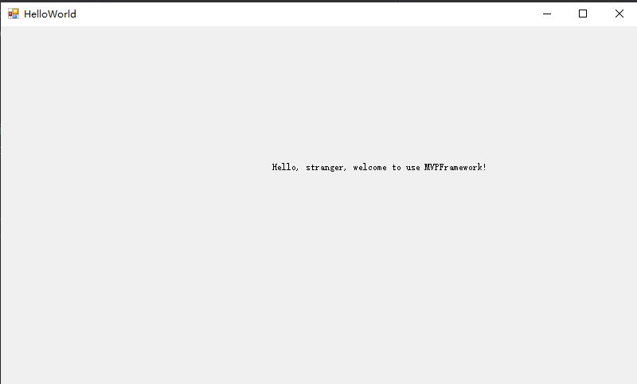

# MVPFramework_Demo
这个项目主要包含MVPFramework一些样例。

项目结构的划分:
```
+ MVPFramework_Demo
	+ Models // 保存数据结构的定义
	+ Presenters // 与界面显示相关的数据的逻辑处理
	+ Views
		+ Interfaces // 需要暴露给Presenter的接口
		+ UIComponents // 界面、组件
		+ UILogic // 界面显示的逻辑
```

### 最简单的HelloWorld
1. 创建View组件。 新建一个Winform窗体,并添加一个Label组件  

2. 创建View层暴露给Presenter层的逻辑接口。继承IViewLogic即可。
```
    public interface IHelloWorldView:IViewLogic
    {
        void LayoutSayTxt(string sayTxt);
    }
```
3. 实现ViewLogic层。此层与View组件进行了绑定，且实现了暴露给Presenter层的逻辑接口。
```
public class HelloWorldViewLogic : ViewLogic<HelloWorldView, IHelloWorldView>, IHelloWorldView
    {
        public void Activate()
        {
            target?.Activate();
        }

        public void Close()
        {
            target?.Close();
        }

        public void LayoutSayTxt(string sayTxt)
        {
            target.lbsay.Text = sayTxt;
        }

        public void Show()
        {
            target?.Show();
        }
    }
```
4. 实现Presenter层。此层通过特性的方式与ViewLogic层绑定.
```
    [ViewLogicBinding(typeof(HelloWorldViewLogic))]
    public class HelloWorldPresenter : Presenter<IHelloWorldView>
    {
        public HelloWorldPresenter()
        {
            UpdateSayToWho("stranger");
        }

        public void Show(bool isShow)
        {
            if (isShow) { View.Show(); }
            else { View.Close(); }
        }

        public void UpdateSayToWho(string name)
        {
            View.LayoutSayTxt("Hello, " + name + ", welcome to use MVPFramework!");
        }
    }
```
5. 将界面放到PresenterStub中进行统一管理。
```
    public class PresenterStub
    {
        // HelloWorld 界面
        private static HelloWorldPresenter _helloWorldPresenter = null;
        public static HelloWorldPresenter HelloWorldPresenter
        {
            set => _helloWorldPresenter = value;
            get
            {
                if (_helloWorldPresenter == null)
                {
                    _helloWorldPresenter = new HelloWorldPresenter();
                }
                return _helloWorldPresenter;
            }
        }
    }
```
6. 运行。如果没有问题, 会得到下面的界面


### 一些复杂的用法举例
1. Presenter:ViewLogic = 1:N的关系, 实现如下:
```
    [ViewLogicBinding(typeof(DataPart1ViewLogic))]// 绑定DataPart1ViewLogic
    [ViewLogicBinding(typeof(DataPart2ViewLogic))]// 绑定DataPart2ViewLogic
    public class DataPartPresenter : PresenterNN
    {
		public void XXXMethod()
		{
			if(hasViewLogicType<DataPart1ViewLogic>())
			{
				var viewLogic = GetOrCreateViewLogic(typeof(DataPart1ViewLogic)) as DataPart1ViewLogic;
				//...
			}
		}
		
    }
```
a. 在Presenter上声明多个特性即可完成1:N的绑定关系
b. Presenter需要继承PresenterNN
c. 获取Presenter的实例, 可以通过** GetOrCreateViewLogic(Type type) ** 获取
d. 如果想缓存Model，可以在类中定义， 也可以通过** AddModel(Model model) ** 来直接添加，获取通过** GetModel<T>() ** 直接获取

2. Presenter:ViewLogic = 1:1的关系, 就是在最前面演示的HelloWorld， 如果想实现数据缓存, 直接对 ** Model ** 进行赋值即可。
```
Model = modelInfo;
```

3. Presenter:ViewLogic = N:1的关系， 实现如下:
```
	[ViewLogicBinding(typeof(ViewLogicNNViewLogic))]
    public class ViewLogicNNPart1Presenter: Presenter<IViewLogicNNView>
    {
	}
	
    [ViewLogicBinding(typeof(ViewLogicNNViewLogic))]
    public class ViewLogicNNPart2Presenter:Presenter<IViewLogicNNView>
    {
	}
```
与1:1的结构很类似, 这里N:1的关系需要注意的是, 1指的是1个ViewLogic类型， 实际上对于ViewLogic实例来说, 还是Presenter:ViewLogic = 1:1 